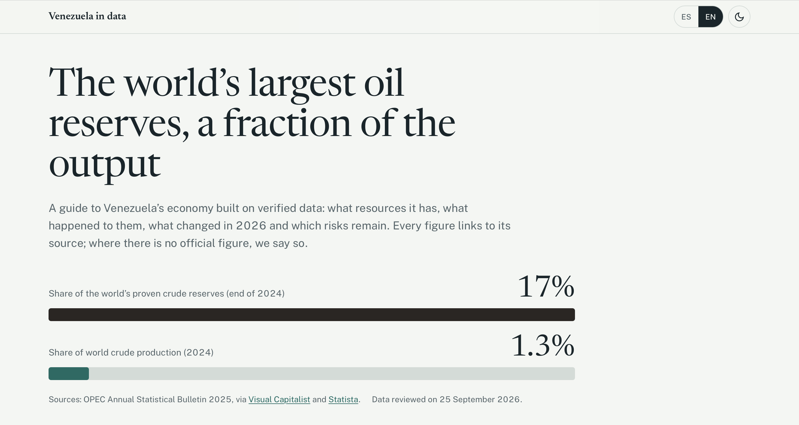

# Venezuela en datos · Venezuela in Data 🇻🇪



**Demo:** https://venezuela-economic-potential.vercel.app

---

## Español

### Qué es

Una guía educativa, con datos verificados, sobre el potencial económico de Venezuela: qué recursos tiene, qué pasó con ellos, qué cambió en 2026 y qué riesgos siguen abiertos.

Cada cifra enlaza a su fuente. Donde no existe un dato oficial comparable, la página lo dice en lugar de inventar un número.

### Contenido

La página se organiza en ocho capítulos:

1. **Reservas.** Reservas probadas de crudo a finales de 2024, comparadas con Arabia Saudita, Irán, Canadá e Irak.
2. **Producción.** Puntos de referencia de la OPEP desde 2002 y comparación con el dato de PDVSA. Incluye un zoom a 2025–2026 y proyecciones de analistas que se pueden activar.
3. **Economía.** PIB en dólares de 1980 a 2027 (FMI) y por qué difiere del dato del Banco Mundial. También recoge las proyecciones del FMI para 2026 y cómo cambiaron en seis meses.
4. **Qué cambió en 2026.** Cronología de la reforma de la Ley de Hidrocarburos, las licencias OFAC y el reglamento.
5. **Mapa.** Estados que abarcan la Faja Petrolífera y el Arco Minero del Orinoco.
6. **Comparativas.** Peso del turismo (España, México) y de la minería en las exportaciones (Perú, Chile).
7. **Riesgos.** Inflación, deuda, sanciones, calidad del crudo, ambiente y disponibilidad de datos.
8. **Fuentes y método.** Todas las fuentes enlazadas.

### Principios de los datos

- **Sin cifras inventadas.** No hay datos ilustrativos ni estimaciones propias.
- **Una sola fuente por serie.** Por ejemplo, el PIB usa solo la serie del FMI, sin mezclar métodos.
- **Cada gráfico lleva una etiqueta:**
  - *Dato oficial:* publicado por un organismo oficial o internacional.
  - *Estimación:* cálculo de terceros sobre un periodo cerrado.
  - *Proyección:* previsión sobre el futuro, que puede cambiar.
- **Transparencia.** Cada gráfico incluye su tabla de datos y descarga en CSV.

### Fuentes principales

- OPEP: Boletín Estadístico Anual 2025 e Informe Mensual del Mercado Petrolero.
- FMI: World Economic Outlook, abril 2026.
- EIA (EE.UU.) y Banco Mundial.
- INE (España), INEGI (México), Banco Central de Chile y SNMPE (Perú).
- Gaceta Oficial de Venezuela y análisis jurídicos de la reforma de 2026.

La lista completa está en el capítulo 8 de la web.

### Tecnología

- **Un único `index.html`**, sin build ni dependencias que instalar.
- **Chart.js 4.4.1** desde jsDelivr, con verificación de integridad (SRI). Solo se carga cuando el usuario llega a un gráfico.
- **Mapa en SVG propio**, con geometría de [Natural Earth](https://www.naturalearthdata.com/) (dominio público).
- **Bilingüe** (ES/EN), con modo claro y oscuro, diseño adaptable a móvil y accesibilidad (tablas alternativas, navegación por teclado, movimiento reducido).

### Actualizar los datos

1. **Cambiar la cifra.** Todas las cifras de los gráficos están en el objeto `DATA`, al final de `index.html`, y las fuentes en `SOURCES`.
2. **Revisar el texto.** Si la cifra aparece también en el texto, actualízala ahí en español (HTML) y en inglés (objeto `EN`).
3. **Actualizar la fecha.** Cambia la fecha de revisión de la portada («Datos revisados el…»).

Datos que cambian con frecuencia:

- Producción petrolera mensual de la OPEP.
- Licencias OFAC.
- Proyecciones del FMI (nuevo WEO en abril y octubre).

### Ver en local

Abre `index.html` en el navegador o sirve la carpeta:

```bash
python3 -m http.server 8000
```

### ¿Has encontrado un error?

Usa el formulario de [corrección de dato](https://github.com/flormpecasique/Venezuela-economic-potential/issues/new?template=correccion-de-dato.yml). Solo se publican cifras con una fuente verificable.

### Autora

**Flor Peña.** Proyecto de análisis y visualización de datos.

> Contenido educativo. No constituye asesoramiento financiero ni de inversión.

---

## English

### What it is

An educational guide, built on verified data, to Venezuela's economic potential: what resources it has, what happened to them, what changed in 2026 and which risks remain.

Every figure links to its source. Where no comparable official figure exists, the page says so instead of inventing one.

### Contents

The page is organised in eight chapters:

1. **Reserves.** Proven crude reserves at the end of 2024, compared with Saudi Arabia, Iran, Canada and Iraq.
2. **Production.** OPEC reference points since 2002 and comparison with PDVSA's own figure. Includes a 2025–2026 zoom and optional analyst projections.
3. **Economy.** Dollar GDP from 1980 to 2027 (IMF) and why it differs from the World Bank figure. Also covers the IMF's 2026 projections and how they changed in six months.
4. **What changed in 2026.** Timeline of the Hydrocarbons Law reform, OFAC licences and the implementing regulations.
5. **Map.** States covered by the Orinoco Oil Belt and the Orinoco Mining Arc.
6. **Comparisons.** Tourism's share of GDP (Spain, Mexico) and mining's share of exports (Peru, Chile).
7. **Risks.** Inflation, debt, sanctions, crude quality, environment and data availability.
8. **Sources and method.** All sources, linked.

### Data principles

- **No invented figures.** No illustrative data and no estimates of our own.
- **One source per series.** For example, GDP uses only the IMF series, without mixing methods.
- **Every chart is labelled:**
  - *Official data:* published by an official or international body.
  - *Estimate:* third-party calculation for a closed period.
  - *Projection:* a forecast about the future, which may change.
- **Transparency.** Every chart includes its data table and a CSV download.

### Main sources

- OPEC: Annual Statistical Bulletin 2025 and Monthly Oil Market Report.
- IMF: World Economic Outlook, April 2026.
- US EIA and World Bank.
- INE (Spain), INEGI (Mexico), Central Bank of Chile and SNMPE (Peru).
- Venezuela's Official Gazette and legal analyses of the 2026 reform.

The full list is in chapter 8 of the site.

### Technology

- **A single `index.html`**, with no build step and nothing to install.
- **Chart.js 4.4.1** from jsDelivr, with Subresource Integrity (SRI). It only loads when the user reaches a chart.
- **Custom SVG map**, with geometry from [Natural Earth](https://www.naturalearthdata.com/) (public domain).
- **Bilingual** (ES/EN), with light and dark themes, a mobile-first layout and accessibility features (alternative tables, keyboard navigation, reduced motion).

### Updating the data

1. **Change the figure.** All chart figures live in the `DATA` object at the end of `index.html`, and sources in `SOURCES`.
2. **Check the text.** If the figure also appears in the text, update it there in Spanish (HTML) and in English (`EN` object).
3. **Update the date.** Change the review date on the front page ("Data reviewed on…").

Frequently changing data:

- OPEC monthly oil production.
- OFAC licences.
- IMF projections (new WEO every April and October).

### Run locally

Open `index.html` in a browser, or serve the folder:

```bash
python3 -m http.server 8000
```

### Found an error?

Use the [data correction form](https://github.com/flormpecasique/Venezuela-economic-potential/issues/new?template=correccion-de-dato.yml). Only figures with a verifiable source are published.

### Author

**Flor Peña.** Data analysis and visualisation project.

> Educational content. Not financial or investment advice.
